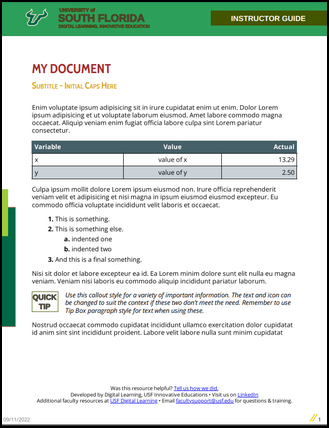

# USF Learning Guides

This repo demonstrates a workflow where content can be authored
in a simple format (markdown) to create a resulting PDF.
It makes use of Pandoc templates to produce HTML styled with special CSS
that PagedJS uses to generate the output documents.

USF Learning Guides are used as an example for this proof-of-concept.
This repository is not directly associated with USF.

**Contents:**

-  [About markdown](#about-markdown)
-  [Editing content online in Github](#editing-content-online-in-github)
-  [Optional: Installing locally](#optional-installing-locally)
-  [Optional: Authoring locally](#optional-authoring-locally)

## About markdown

The general idea is to author content in a text file with more attention spent on its meaning
than style and layout.
After the text file is saved, a build process uses a stylized template to render a final PDF.
The markdown syntax used for the text file is a fairly intuitive and popular method of
authoring that [can be learned in no time](https://www.markdownguide.org/cheat-sheet/).

The source files are written in Pandoc markdown, which is
[standard markdown](https://daringfireball.net/projects/markdown/syntax)
with [Pandoc extensions](https://pandoc.org/MANUAL.html#pandocs-markdown).

**Heading information:**

The metadata block at the top of the source file
(encapsulated within three-dash delimiters `---`)
must contain the following properties:
`title`, `subtitle`, and `date`.
The default guide is an Instructor Guide;
if auhoring a Student Guide, set the optional
`student-guide` property to any value, such as `true`.

```yaml
---
title: Your amazing title
subtitle: its subtitle
date: MM/DD/YYYY
student-guide: true
---
```

**Special blocks:**

This is content contained within a block indicated with starting
and ending `:::` markers, with particular classes indicated after
the beginning marker. For example, the following block indicates
a TIP block (using the `tip` style)

```markdown
::: {.tip}
This is a tip.
:::
```

Other styles are `sidebar-right`, `sidebar-left`, and `step`.
The `step` style also requires a `first-step` style on the first
step to reset the step counter.
Steps can also include a prefix icon. The available icons are:

|style|icon|
|---|---|
|think||

Check out the Raw or Blame view of the [`content/test.md`](content/test.md) file for example markdown source,
and the [`test.pdf`](https://arkadianriver.github.io/usf-learning-guides/test.pdf) file for its output.
(Note that when publishing to production, PDF filenames that start with `test` are not published.)

<p align="center">
  <a href="https://arkadianriver.github.io/usf-learning-guides/test.pdf" target="_blank"></a>
</p>

## Editing content online in Github

If you're new to git and Github, there is a bunch of terminology to learn and get used to
in the steps that follow, but worry not, the Github interface guides you along the way fairly well.

1.  If you have not already done so,
    [fork the repository](https://github.com/arkadianriver/usf-learning-guides/fork).
    If you have forked the repo, be sure to
    [update your fork](https://docs.github.com/en/pull-requests/collaborating-with-pull-requests/working-with-forks/syncing-a-fork)
    with the latest changes from the upstream repository.

1.  In your fork, create or edit a markdown file in the [`content` directory](content).
    If your content contains images, you will be uploading them to the
    `resources` folder in step 4. Reference that location in your markdown
    content.
    
    ```markdown
    
    ```

1.  When satisfied with your content changes,
    describe the change in a few words at the bottom of the Edit page,
    select Create a new branch,
    provide a meaningful branch name, and click **Commit changes**.
    The changes are made in the specified branch in your forked repository.

1.  If your source contains images, upload them to the `resources` folder in your repository.
    Commit each upload to the same branch in your repo as the markdown file you've edited.

1.  Create a Pull Request (PR), pulling the branch on your fork into the
    `dev` branch of the "upstream" `arkadianriver/usf-learning-guides` repository.
    Make sure to select the correct branches and repositories in the pull request.
    The interface displays the pull from right to left, such as:
    
    **dev** of `arkadianriver/usf-learning-guides` ← **your-custom-branch** of `YOUR-ID/usf-learning-guides`
    
1.  Once submitted, your colleagues can go to the upstream branch and review, comment, and
    discuss the changes before an authorized person merges your request into the
    `dev` branch.

1.  A minute or two after the request has been merged, you can view the PDFs
    [on Github pages](https://arkadianriver.github.io/usf-learning-guides/).

1.  When ready to publish the reviewed PDFs, an authorized person
    merges the `dev` branch into the `main` branch.
    After a minute or two, view the PDFs at the published location.
    (@TODO: You can publish to Sharepoint, for example with
    [this workflow action](https://github.com/marketplace/actions/publish-to-sharepoint).
    Or, simply [download the PDFs](https://github.com/arkadianriver/usf-learning-guides/blob/gh-pages/test.pdf)
    from Github individually and publish manually.)


## Optional: Installing locally

Recommended only if you are comfortable with using the Terminal and **git** from your workstation,
such as to push and pull changes between your fork's clone, origin, and upstream.

**Mac:**

1.  Homebrew (to easily install Pandoc):

    ```bash
    /bin/bash -c "$(curl -fsSL https://raw.githubusercontent.com/Homebrew/install/HEAD/install.sh)"
    ```

1.  Pandoc (to create the HTML file, using the template):

    ```bash
    brew install pandoc
    ```

1.  Node version manager (to easily switch Node versions):

    ```bash
    curl -o- https://raw.githubusercontent.com/nvm-sh/nvm/v0.39.1/install.sh | bash
    ```

    After that, restart the Terminal.

1.  Node JS (prerequisite to PagedJS; version 16 is a good stable one):

    ```bash
    nvm install 16
    ```

1.  Paged JS (to render the HTML as a PDF):

    ```bash
    npm install -g pagedjs-cli pagedjs
    ```

## Optional: Authoring locally

1.  Edit a markdown file in the `content` directory:

    ```markdown
    ---
    title: How to Lorem ipsum
    subtitle: A study of Amet ex irure
    date: 09/11/2022
    ---

    Lorem ipsum ...

    ::: {.sidebar-right}
    This is a sidebar comment. yada, yada, yada.
    :::

    Lorem ipsum ...
    ```

1.  Build the markdown files into PDFs:

    ```bash
    ./build.sh
    ```

1.  View your PDF files in the output folder.


